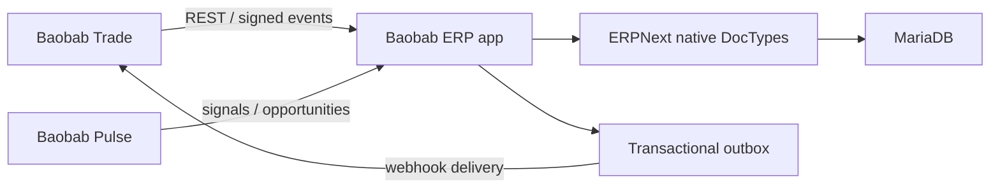

# Baobab ERP

Baobab ERP is the independently deployable ERP Engine of the Baobab Platform. It runs on Frappe Framework and ERPNext and adds a deliberately small Baobab custom application for tenancy context, canonical identity mapping, integration events, and audit metadata.

It is an operational system and API provider. Subsidiary websites and frontends do not belong here.

## Boundaries

| Area | Owner | Rule |
|---|---|---|
| Frappe Framework | `frappe/frappe` | Installed from the pinned upstream release; never modified here |
| ERPNext | `frappe/erpnext` | Installed from the pinned upstream release; standard DocTypes remain authoritative |
| Baobab ERP app | `apps/baobab_erp` | Baobab-specific mappings, context, events, APIs, and audit fields |
| Canonical contracts | `nabhold/shared` | Organisation-wide identities and obligations; referenced, not redefined |
| Engine contracts | `contracts` | ERP-owned API/event profiles conforming to shared governance |
| Deployment | `deploy` | Docker/Bench topology and operational configuration |

## Architecture



There is no shared database between engines. Canonical identifiers are mapped to ERPNext records rather than replacing them.

## Pinned upstream

- Frappe Framework: `v16.32.0`
- ERPNext: `v16.33.0`
- Database: MariaDB 11.8 LTS
- Redis: 7.4

See `upstream.lock.yaml`. Upgrades are reviewed changes and must run the compatibility suite.

## Development

The Codespaces configuration uses `ghcr.io/nabhold/baobab-dev:1.0.0` and initializes a native Bench workspace in `.bench`.

```bash
cp .env.example .env
./scripts/dev/bootstrap.sh
./scripts/dev/start.sh
```

The first bootstrap creates `baobab.localhost`, installs ERPNext and `baobab_erp`, and leaves upstream repositories under `.bench/apps`. The source of the Baobab custom app remains this repository's `apps/baobab_erp` directory.

## Runtime

```bash
cp .env.example .env
# Replace every change-me value before continuing.
docker compose -f deploy/compose.yaml build
docker compose -f deploy/compose.yaml up -d
```

This Compose topology is a production-oriented single-host baseline, not a claim that one host is sufficient forever. Production must terminate TLS at an approved reverse proxy, use managed secrets, external backups, monitoring, and tested recovery procedures.

## Documentation

- [System architecture](docs/architecture/system.md)
- [Tenancy and organisation mapping](docs/architecture/tenancy.md)
- [Canonical mapping strategy](docs/architecture/entity-mapping.md)
- [Integration architecture](docs/architecture/integrations.md)
- [Deployment](docs/operations/deployment.md)
- [Testing](docs/development/testing.md)
- [ADRs](docs/adr/README.md)

## Status

Foundation stage. The repository contains a deployable topology and installable custom app skeleton with persistence and extension points. It does not yet contain subsidiary-specific ERP configuration or production credentials.

## Licence

GPL-3.0. See [LICENSE](LICENSE). Upstream Frappe and ERPNext retain their own copyright and licensing notices.

## Foundation 4

The Compose-backed Codespace uses `ghcr.io/nabhold/baobab-dev:1.2.6`. The
SHA-pinned Foundation gate validates contracts and reproducibility and scans
source, dependencies, secrets, configuration, and the ERP deployment image.
