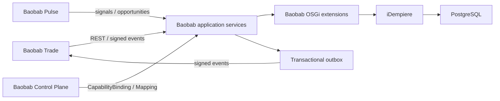

# Baobab ERP

Baobab ERP is the independently deployable ERP Engine of the Baobab Platform. It runs on
iDempiere and adds Baobab-specific tenancy context, canonical identity mapping,
integration events, and audit metadata through OSGi extensions and an application-service
layer, per ADR-ERP-001 through ADR-ERP-020.

It is an operational system and API provider. Subsidiary websites and frontends do not
belong here.

## Boundaries

| Area | Owner | Rule |
|---|---|---|
| iDempiere | `idempiere/idempiere` | Installed from the pinned upstream release; never modified here — see `idempiere/patches/README.md` |
| Baobab OSGi extensions | `idempiere/extensions/` | Baobab-specific behaviour installed as additional plugins under `org.nabhold.baobab.erp.*` |
| Application services | `modules/` | Context, mapping, events, outbox/inbox, reconciliation, provisioning — framework-free, backed by Protocol interfaces |
| Baobab-owned schema | `db/` | Postgres migrations for the `baobab` schema, separate from iDempiere's own tables |
| Canonical contracts | `nabhold/shared` | Organisation-wide identities and obligations; referenced, not redefined |
| Engine contracts | `contracts/` | ERP-owned API/event profiles conforming to shared governance |
| Migration tooling | `migration/` | Scaffolding for a future ERPNext-source migration; currently unused — see `migration/README.md` |

## Architecture



There is no shared database between engines. Canonical identifiers are mapped to
iDempiere records rather than replacing them; see ADR-ERP-002 and ADR-ERP-007.

## Pinned upstream

- iDempiere: `13-release` ("Orion" LTS)
- Database: PostgreSQL 16
- Java: 17

See `upstream.lock.yaml`. Upgrades are reviewed changes and must run the compatibility
suite.

## Development

```bash
cp .env.example .env
./scripts/dev/bootstrap.sh
```

The Codespaces configuration uses `ghcr.io/nabhold/baobab-dev:1.2.6` and provisions a
PostgreSQL instance for the `modules/` test suite and Maven/Java for the OSGi extensions.

## Runtime

```bash
cp .env.example .env
# Replace every change-me value before continuing.
docker compose build
docker compose up -d
```

This Compose topology stands up the iDempiere + PostgreSQL runtime baseline (Phase 4). It
is a production-oriented single-host baseline, not a claim that one host is sufficient
forever. Production must terminate TLS at an approved reverse proxy, use managed secrets,
external backups, monitoring, and tested recovery procedures.

## Documentation

- [System architecture](docs/architecture.md)
- [Tenancy and organisation mapping](docs/tenancy.md)
- [Integration architecture](docs/integration.md)
- [Canonical events](docs/events.md)
- [Development](docs/development.md)
- [Testing](docs/testing.md)
- [Security](docs/security.md)
- [Operations](docs/operations.md)
- [Provisioning](docs/provisioning.md)
- [ADRs](docs/adr/README.md)
- [Migration programme](docs/migration/00-target-architecture.md)

## Status

Foundation stage, targeting iDempiere. This repository previously carried a Frappe/
ERPNext foundation-stage scaffold with no tenant, financial, or transactional data ever
created against it; it has been replaced outright rather than migrated, because there was
nothing running to migrate from. See `docs/migration/erpnext-removal-report.md`.

The repository contains a real, buildable OSGi extension skeleton; a Compose-based
runtime for PostgreSQL, iDempiere, and the `baobab-app` HTTP service; and an
application-service layer with Postgres-backed context/mapping/outbox/inbox stores and
an inbound event webhook, tested against a real database in `tests/integration/`. It
does not yet contain LegalEntity accounting configuration, a wired iDempiere API client,
or a production `EngineInstance` — see `architecture/conformance.yaml` for an honest
per-ADR status ledger.

## Licence

GPL-3.0. See [LICENSE](LICENSE). Upstream iDempiere retains its own copyright and
licensing notices.
