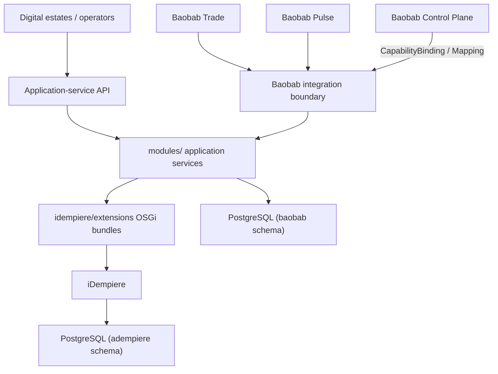

# System Architecture

Baobab ERP is a headless ERP engine built on iDempiere. iDempiere's own web client
remains available for authorised operational users, but no subsidiary customer frontend
is hosted in this repository.

## Ownership rules

1. Upstream iDempiere is installed by pinned image tag and remains unmodified.
2. ERP configuration uses standard iDempiere facilities first (Window/Tab/Field, Model
   Validators, event handlers) before a custom OSGi bundle.
3. Baobab-specific persistence uses the `baobab` Postgres schema (`db/migrations`), never
   iDempiere's own tables.
4. `modules/integration` is the only code that knows iDempiere's actual API shape;
   everything else deals in canonical contracts.
5. Cross-engine calls use supported APIs or signed events, never SQL or shared tables.

## EngineInstance and isolation

Isolation between tenants, legal entities, and markets is governed by `IsolationProfile`
resolved by the Control Plane (ADR-ERP-002, ADR-ERP-003), not by a single hard-coded
topology. `AD_Client`/`AD_Org` are iDempiere-native concepts mapped from, never assumed
equal to, Baobab's `Tenant`/`LegalEntity`.

## What exists today vs. what is designed

This document describes the target shape accepted across ADR-ERP-001–020. See
`architecture/conformance.yaml` for which parts are implemented, partially implemented,
or still planned — do not assume every box in the diagram above is wired end to end yet.
