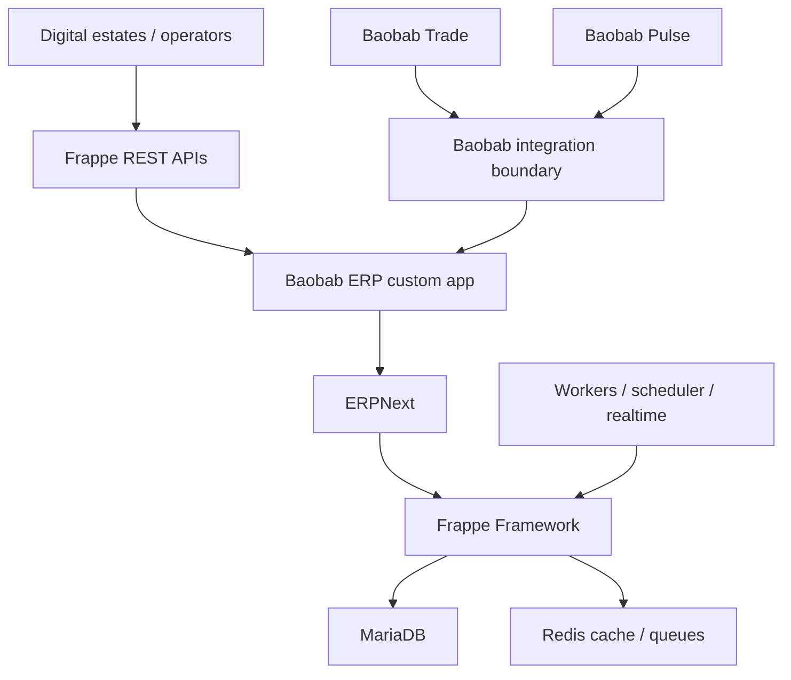

# System Architecture

Baobab ERP is a headless-capable ERP engine. Frappe Desk remains available for authorised operational users, but no subsidiary customer frontend is hosted in this repository.

## Ownership rules

1. Upstream code is installed by pinned tag and remains unmodified.
2. ERP configuration uses standard ERPNext facilities first.
3. Baobab-specific persistence uses custom DocTypes in `baobab_erp`.
4. Integration handlers translate contracts into standard ERPNext document operations.
5. Cross-engine calls use supported APIs or signed events, never SQL or shared tables.

## Site strategy

The initial deployment uses one Frappe site per tenant isolation boundary. A legal entity is the default boundary, but provisioning may select another approved boundary. This uses Frappe's native site isolation rather than pretending that ERPNext `Company` alone is a security boundary. A site may contain multiple Companies only when an explicit tenancy decision permits it.
